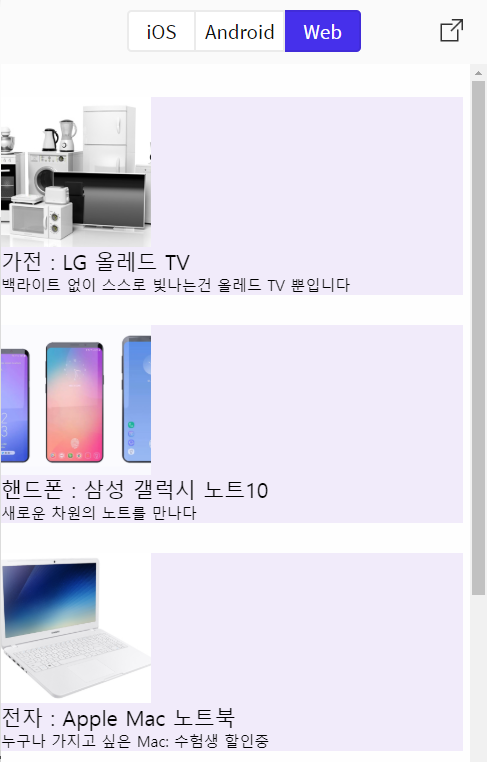

## React Native를 이용하여 쇼핑몰 앱 개발하기




### flatlistdata.js

```js
const flatListData = [
    {
        "key" :"LG 올레드 TV",
        "list" :"가전",
        "Description" : "백라이트 없이 스스로 빛나는건 올레드 TV 뿐입니다",
    "imageUrl":"http://www.newsworks.co.kr/news/photo/201702/113036_23243_3953.jpg"
    },
    {
        "key" :"삼성 갤럭시 노트10",
        "list" :"핸드폰",
        "Description" : "새로운 차원의 노트를 만나다",
        "imageUrl" : "https://post-phinf.pstatic.net/MjAxODEyMDlfNzEg/MDAxNTQ0MzQ4NDkyOTU0.GJNiffmThf5k6sBYNyjntufaqL4wzEkb5IAuwIqA2Qgg.p5DZQWZeJrhGjR6GSt0rrv_6PRPtPe_tnfDqbseh1NYg.PNG/0005.png?type=w1200"
    },
    {
        "key" :"Apple Mac 노트북",
        "list" :"전자",
        "Description" : "누구나 가지고 싶은 Mac: 수험생 할인중",
        "imageUrl" : "https://img.kr.news.samsung.com/kr/wp-content/uploads/2018/07/20180724-pressrelease-optane-1.jpg"
    },
    {
        "key" :"한샘 탁자",
        "list" :"가구",
        "Description" : "깔끔한 가구",
        "imageUrl" : "http://www.paroma.co.kr/default/img/images/main_brand.jpg"

    },
];

export  default flatListData;
```

- App.js에서 부를 flatlist 데이터 
  - key: 제품 이름
  - list: 제품 카테고리
  - Description: 제품 설명
  - imageUrl: 가져올 제품 이미지 url


### App.js

```js
import React, {Component} from 'react';

import {AppRegistry,Image,FlatList,StyleSheet,Text,View} from 'react-native';
import flatListData from './flatlistdata'

class FlatListItem extends Component{
    render() {
        return(
          <View style ={{flex:1,marginBottom:20, marginRight:5,justifyContent: 'center', alignItems: 'left', backgroundColor: '#f1ebfa'}}>
          
              <Image source={{uri:this.props.item.imageUrl ,width : 100 , height: 100}}></Image>
              <Text>{this.props.item.list} : {this.props.item.key}</Text>
              <Text style ={{fontSize:10, color: 'blue'}}>{this.props.item.Description}</Text>
          </View>

        );
    }
}
class BasicFlatList extends Component {

    render() {
        return (
           <View style={{flex: 1,  marginTop: 22 , justifyContent: 'center'}}>
               <FlatList
                    data ={flatListData}
                    horizontal = {false}
                    renderItem = {({item,index})=>{
                        return(<FlatListItem item={item} index = {index}/>);
                    }}
               />
           </View>
        );
    }
}

export default BasicFlatList;
```

Class **FlatListItem**

* ` <View style ={{flex:1,marginBottom:20, marginRight:5,justifyContent: 'center', alignItems: 'left', backgroundColor: '#f1ebfa'}}>`
  * 리스트뷰 style 설정
* ` <Image source={{uri:this.props.item.imageUrl ,width : 100 , height: 100}}></Image>` 
  * 리스트에 보여줄 Image source를 item.imageUrl 에서 가져온다. 
* ` <Text>{this.props.item.list} : {this.props.item.key}</Text>`
  * flatlistdata.js 로부터 카테고리명(item.list) 과 아이템 이름(item.key) 을 가져온다. 
* `<Text style ={{fontSize:10}}>{this.props.item.Description}</Text>`
  * 해당 상품에 대한 설명(item.Description)을 가져온다


Class **BasicFlatList**

* FlatList 설정


